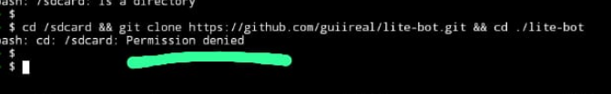

<div align="center">
    
</div>

<br />

<div align="center">
    <a href="https://github.com/guiireal/lite-bot">
        
    </a>
</div>

<br />

# Bot de WhatsApp minimalista multifunções

## Tecnologias envolvidas

- [Axios](https://axios-http.com/ptbr/docs/intro)
- [Baileys](https://github.com/WhiskeySockets/Baileys)
- [FFMPEG](https://ffmpeg.org/)
- [Node.js 20.18.x](https://nodejs.org/en)
- [Spider X API](https://api.spiderx.com.br)
- [Yarn 1.22.22](https://yarnpkg.com)

## ⚠ Atenção

Nós não prestamos suporte gratuíto caso você tenha adquirido esta base com terceiros e tenha pago por isso. 
Solicite que **a pessoa que te vendeu, forneça suporte**.
Nós não temos vínculo nenhum com terceiros e não nos responsabilizamos por isso, nem prestamos suporte nessas condições.

## Instalação no Termux <a id="termux-setup"></a>

1 - Abra o Termux e execute os comandos abaixo.<br/>
_Não tem o Termux? [Clique aqui e baixe a última versão](https://www.mediafire.com/file/082otphidepx7aq/Termux_0.119.1_aldebaran_dev.apk)._

2 - Digite:

```sh
termux-setup-storage
```

E aceite as permissões que pedir.

3 - Cole o seguinte código:

```sh
pkg upgrade -y && pkg update -y && pkg install git -y && pkg install nodejs-lts -y && pkg install ffmpeg -y && npm install -g yarn
```

4 - Quando finalizar tudo, digite o código abaixo:

```sh
cd /sdcard && git clone https://github.com/Deep-Shadow/jarvis-bot.git && cd ./jarvis-bot
```

5 - Configure o arquivo `config.js`. O bot fica dentro da pasta `/sdcard/jarvis-bot`.
_Use o [MT Manager](https://www.mediafire.com/file/y09xgucgygmt1ny/MT_Manager_2.16.7_Dev_Gui.apk/file) ou o [ZArchiver](https://play.google.com/store/apps/details?id=ru.zdevs.zarchiver&hl=pt_BR) para fazer isso (localizar a pasta)._

```js
// Prefixo dos comandos
exports.PREFIX = "/";

// Emoji do bot (mude se preferir).
exports.BOT_EMOJI = "🤖";

// Nome do bot (mude se preferir).
exports.BOT_NAME = "Jarvis Bot";

// Número do bot. Coloque o número do bot (apenas números).
exports.BOT_NUMBER = "5511920202020";

// Número do dono do bot. Coloque o número do dono do bot (apenas números).
exports.OWNER_NUMBER = "5511999999999";
```
6 - Salve o que você acabou de configurar.

7 - Vá no termux e digite `/sdcard/jarvis-bot`.

8 - Rode o comando `yarn start` ou `npm start` e informe seu número de telefone.

9 - Coloque o código de pareamento em "dispositivos conectados" no WhatsApp.

10 - Aguarde 10 segundos, depois digite `CTRL + C` 2x para parar o bot.

11 - Inicie o bot novamente, dentro da pasta `jarvis-bot`:
```sh
yarn start
```

ou

```sh
npm start
```

## Alguns comandos necessitam de API

Edite a linha `47` do arquivo `config.js` e cole sua api key da plataforma Spider X API.<br/>
Para obter seu token, acesse: [https://api.spiderx.com.br](https://api.spiderx.com.br) e crie sua conta gratuitamente!

```js
exports.SPIDER_API_TOKEN = "seu_token_aqui";
```

Edite a linha `50` do arquivo `config.js` e cole sua api key da plataforma Shadow API.<br/>
Para obter seu token, acesse: [https://shadow-api-3vz5.onrender.com](https://shadow-api-3vz5.onrender.com) e crie sua conta gratuitamente!

```js
exports.SHADOW_API_TOKEN = "seu_token_aqui";
```
## Funcionalidades
| Função | Online? | Contexto | Requer API? |
|---|---|---|---|
| Desligar o bot no grupo | ✅ | Dono | ❌ |
| Ligar o bot no grupo | ✅ | Dono | ❌ |
| Executar comandos do sistema | ✅ | Dono | ❌ |
| Definir imagem do menu | ✅ | Dono | ❌ |
| Abrir o grupo | ✅ | Admin | ❌ |
| Anti link | ✅ | Admin | ❌ |
| Banir membros | ✅ | Admin | ❌ |
| Apagar mensagem do bot | ✅ | Admin | ❌ |
| Fechar o grupo | ✅ | Admin | ❌ |
| Marcar todos | ✅ | Admin | ❌ |
| Limpar o chat do grupo | ✅ | Admin | ❌ |
| Promover a administrador | ✅ | Admin | ❌ |
| Rebaixar administrador | ✅ | Admin | ❌ |
| Fazer pergunta ao bot (IA) | ✅ | Membro | ✅ |
| Figurinha de texto animada | ✅ | Membro | ✅ |
| Aplicar desfoque em imagem | ✅ | Membro | ❌ |
| Busca CEP | ✅ | Membro | ✅ |
| Aplicar contraste em imagem | ✅ | Membro | ❌ |
| Rolar dado | ✅ | Membro | ❌ |
| Criar enquete | ✅ | Membro | ❌ |
| Espelhar imagem | ✅ | Membro | ❌ |
| Criar mensagem fake | ✅ | Membro | ❌ |
| Obter JID/LID de contato | ✅ | Membro | ❌ |
| Converter imagem para escala de cinza | ✅ | Membro | ❌ |
| Baixar vídeos do Instagram | ✅ | Membro | ✅ |
| Silenciar membro no grupo | ✅ | Membro | ❌ |
| Mostrar perfil de usuário | ✅ | Membro | ❌ |
| Verificar tempo de resposta | ✅ | Membro | ❌ |
| Baixar mídia do Pinterest | ✅ | Membro | ✅ |
| Aplicar pixelização em imagem | ✅ | Membro | ❌ |
| Baixar e enviar áudio do YouTube | ✅ | Membro | ✅ |
| Baixar e enviar vídeo do YouTube | ✅ | Membro | ✅ |
| Exibir JSON da mensagem atual | ✅ | Membro | ❌ |
| Renomear figurinha | ✅ | Membro | ❌ |
| Revelar imagem/vídeo temporário | ✅ | Membro | ❌ |
| Criar figurinha | ✅ | Membro | ❌ |
| Pesquisar e enviar vídeo do TikTok | ✅ | Membro | ✅ |
| Converter figurinha para imagem | ✅ | Membro | ❌ |
| Figurinha de texto estática | ✅ | Membro | ✅ |
| Gerar link para imagem enviada | ✅ | Membro | ❌ |
| Comando de teste | ✅ | Membro | ❌ |

## Erros comuns

### Causa: Permission denied (permissão negada) ao acessar `cd /sdcard`

<br/>

<div align="center">
    
</div>


### Solução: abra o termux, digite `termux-setup-storage` e depois, aceite as permissões

## Licença

[GPL-3.0](https://github.com/Deep-Shadow/jarvis-bot?tab=License-1-ov-file)

Este projeto está licenciado sob a Licença Pública Geral GNU (GPL-3.0).<br/>
Isso significa que:

- Você pode usar este código como quiser, seja para projetos pessoais ou comerciais.
- Você pode modificar o código para adaptá-lo às suas necessidades.
- Você pode compartilhar ou vender o código, mesmo modificado, mas precisa:
- Manter os créditos ao autor original (Guilherme França - Dev Gui).
- Tornar o código modificado disponível sob a mesma licença GPL-3.0.

O que você não pode fazer:

- Não pode transformar este código em algo proprietário (fechado) e impedir outras pessoas de acessá-lo ou usá-lo.
Esta licença garante que todos tenham acesso ao código-fonte e podem colaborar livremente, promovendo o compartilhamento e o aprimoramento do projeto.

## ⚠ Disclaimer

Neste projeto, precisei hospedar a node_modules, para auxiliar quem está rodando o bot pelo celular, pois muitos deles podem não rodar o `npm install` ou `yarn` pelo termux corretamente.
