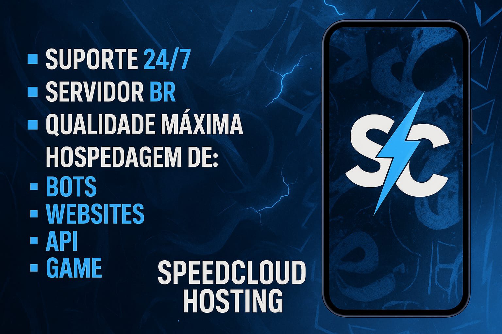
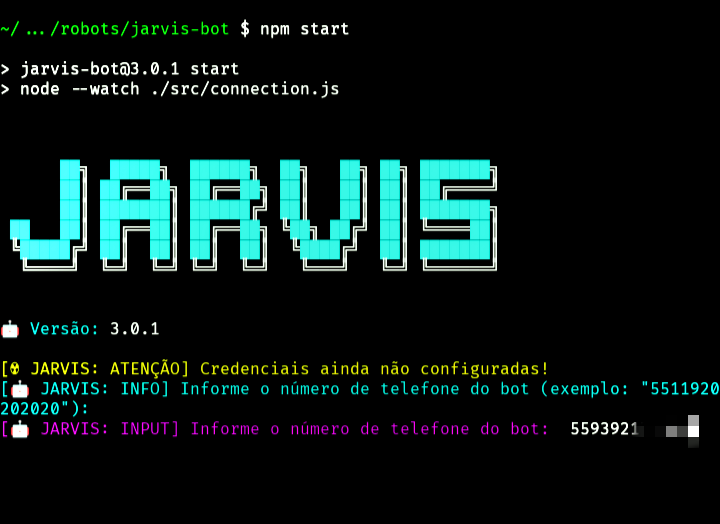
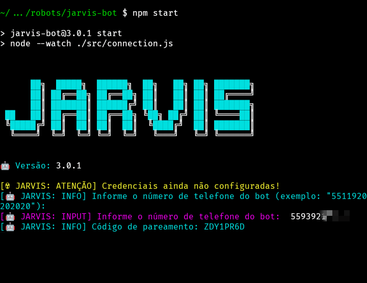
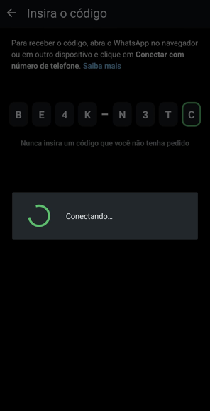
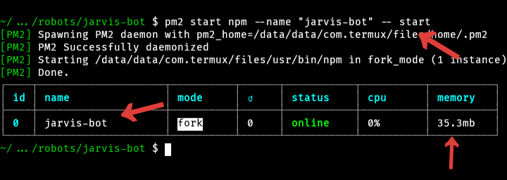
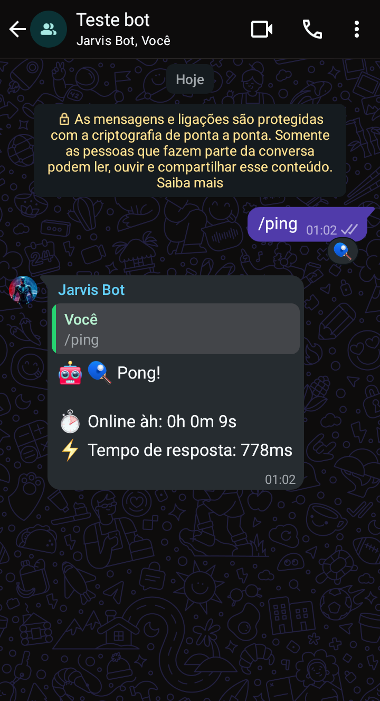
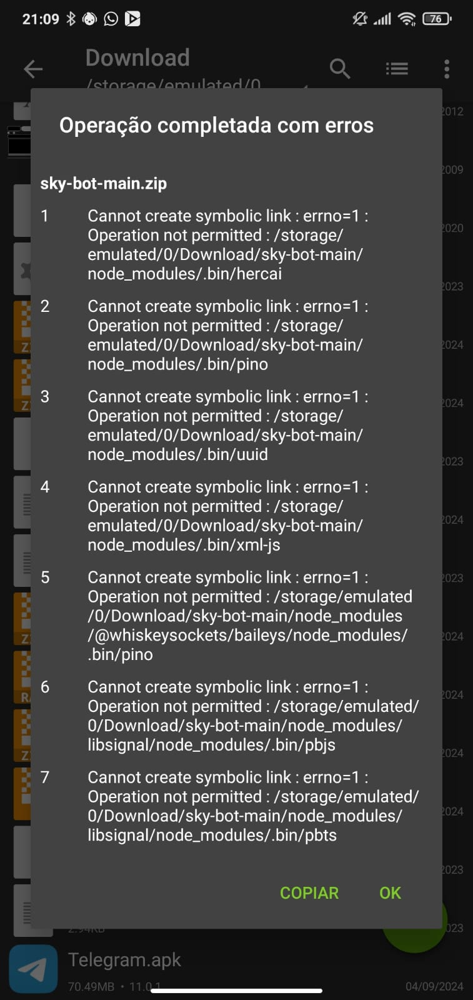

<div align="center">
    
</div>

<br />

<div align="center">
    <a href="https://github.com/guiireal/takeshi-bot">
        
    </a>
</div>

<br />

> Base para bots de WhatsApp multifuncional com diversos comandos prontos.

[](https://nodejs.org/en)
[](https://axios-http.com/ptbr/docs/intro)
[](https://github.com/WhiskeySockets/Baileys)
[](https://ffmpeg.org/)
[](https://api.spiderx.com.br)
[](https://api.spiderx.com.br)


## 📋 Sumário

1. [Sobre o projeto](#sobre-este-projeto)
2. [Atenção - suporte](#-atenção)
3. [Instalação](#instalação)
    - [Instalação no Termux](#instalação-no-termux)
    - [Instalação nas principais hosts do Brasil](#instalação-nas-principais-hosts-do-brasil)
    - [Instalação em VPS (Debian/Ubuntu)](#instalação-em-vps-debianubuntu)
4. [Configuração de API](#alguns-comandos-necessitam-de-api)
5. [Funcionalidades](#funcionalidades)
    - [Funcionalidades gerais](#funcionalidades-gerais)
    - [Funcionalidades de envio](#funcionalidades-de-envio-exemplos)
6. [Auto responder](#auto-responder)
7. [Personalização](#personalização)
    - [Menu do bot](#onde-fica-o-menu-do-bot)
    - [Mensagens de boas vindas](#onde-modifico-a-mensagem-de-boas-vindas-e-quando-alguém-sai-do-grupo)
8. [Implementação técnica](#implementação-técnica-dos-exemplos)
9. [Estrutura de pastas](#estrutura-de-pastas)
10. [Erros comuns](#erros-comuns)
11. [Contribuindo com o projeto](#contribuindo-com-o-projeto)
12. [Licença](#licença)
13. [Disclaimer](#-disclaimer)

## ⚠ Atenção

Nós não prestamos suporte gratuíto caso você tenha adquirido esta base com terceiros e tenha pago por isso.
Solicite que **a pessoa que te vendeu, forneça suporte**.
Nós não temos vínculo nenhum com terceiros e não nos responsabilizamos por isso, nem prestamos suporte nessas condições.

## Sobre este projeto

Este projeto não possui qualquer vínculo oficial com o WhatsApp. Ele foi desenvolvido de forma independente para interações automatizadas por meio da plataforma.

Não nos responsabilizamos por qualquer uso indevido deste bot. É de responsabilidade exclusiva do usuário garantir que sua utilização esteja em conformidade com os termos de uso do WhatsApp e a legislação vigente.

## Instalação no Termux

1 - Abra o Termux e execute os comandos abaixo.<br/>
_Não tem o Termux? [Clique aqui e baixe a última versão](https://www.mediafire.com/file/wxpygdb9bcb5npb/Termux_0.118.3_Dev_Gui.apk) ou [clique aqui e baixe versão da Play Store](https://play.google.com/store/apps/details?id=com.termux) caso a versão do MediaFire anterior não funcione._

```sh
pkg upgrade -y && pkg update -y && pkg install git -y && pkg install nodejs-lts -y && pkg install ffmpeg -y
```

2 - Habilite o acesso da pasta storage, no termux.

```sh
termux-setup-storage
```

3 - Escolha uma pasta de sua preferência pra colocar os arquivos do bot.

Pastas mais utilizadas:

-   /sdcard
-   /storage/emulated/0
-   /storage/emulated/0/Download (muito comum quando você baixa o bot pelo .zip)

No nosso exemplo, vamos para a `/sdcard`

```sh
cd /sdcard
```

4 - Clone o repositório.

```sh
git clone https://github.com/Deep-Shadow/jarvis-bot
```

5 - Entre na pasta que foi clonada.

```sh
cd jarvis-bot
```

6 - Habilite permissões de leitura e escrita (faça apenas 1x esse passo).

```sh
chmod -R 755 ./*
```

7 - Execute o bot.

```sh
npm start
```

8 - Insira o número de telefone e pressione `enter`.

9 - Informe o código que aparece no termux, no seu WhatsApp, [assista aqui, caso não encontre essa opção](https://youtu.be/6zr2NYIYIyc?t=5395).

10 - Aguarde 10 segundos, depois digite `CTRL + C` para parar o bot.

11 - Configure o arquivo `config.js` que está dentro da pasta `src`.

```js
// Prefixo dos comandos
exports.PREFIX = "/";

// Emoji do bot (mude se preferir).
exports.BOT_EMOJI = "🤖";

// Nome do bot (mude se preferir).
exports.BOT_NAME = "Jarvis Bot";

// Número do bot. Coloque o número do bot
// (apenas números, exatamente como está no WhatsApp).
// Se o seu DDD não for de SP ou do Rio, não coloque o 9 antes do número.
exports.BOT_NUMBER = "558112345678";

// Número do dono do bot. Coloque o número do dono do bot
// (apenas números, exatamente como está no WhatsApp).
// Se o seu DDD não for de SP ou do Rio, não coloque o 9 antes do número.
exports.OWNER_NUMBER = "5521950502020";

// LID do dono do bot.
// Para obter o LID do dono do bot, use o comando <prefixo>get-lid @marca ou +telefone do dono.
exports.OWNER_LID = "219999999999999@lid";
```

12 - Inicie o bot novamente.

```sh
npm start
```

## Instalação nas principais hosts do Brasil

**Hosts suportadas**:

| Bronxys                                                             | Nexfuture                                                                  | Speed Cloud                                                                    |
| ------------------------------------------------------------------- | -------------------------------------------------------------------------- | ------------------------------------------------------------------------------ |
| [Grupo oficial](https://chat.whatsapp.com/J5OewHvweK1Kf7RGXAwIYM)   | [Grupo oficial](https://chat.whatsapp.com/Fl5FzZQC00J5CZp07AZVwQ?mode=r_c) | [Grupo oficial](https://chat.whatsapp.com/HsZDn6DJrx34z5lbNbNB2M)              |
| [](https://bronxyshost.com/) | [](https://speedhosting.cloud/) | [](https://speedhosting.cloud/) |

## Instalação em VPS (Debian/Ubuntu)

1 - Abra um novo terminal e execute os seguintes comandos.

```sh
sudo apt update && sudo apt upgrade && sudo apt-get update && sudo apt-get upgrade && sudo apt install ffmpeg
```

2 - Instale o `curl` se não tiver.

```sh
sudo apt install curl
```

3 - Instale o `git` se não tiver.

```sh
sudo apt install git
```

4 - Instale o NVM.

```sh
curl -o- https://raw.githubusercontent.com/nvm-sh/nvm/v0.40.3/install.sh | bash
```

5 - Atualize o source do seu ambiente

```sh
source ~/.bashrc
```

6 - Instale a versão 22 mais recente do node.js.

```sh
nvm install 22
```

7 - Verifique se a versão foi instalada e está ativa.

```sh
node -v # Deve exibir a versão 22
```

8 - Verifique se o npm foi instalado junto.

```sh
npm -v # Deverá exibir a versão do npm
```

9 - Instale o PM2 (recomendado).

```sh
npm install pm2 -g
```

10 - Clone o repositório do bot onde você desejar.

```sh
git clone https://github.com/Deep-Shadow/jarvis-bot
```

11 - Entre na pasta clonada.

```sh
cd jarvis-bot
```

12 - Digite o seguinte comando.

```sh
npm start
```

13 - O bot vai solicitar que você digite seu número de telefone.<br/>
Digite **exatamente** como está no WhatsApp e apenas números.

Não adicione o 9º dígito em números que não sejam de SP ou RJ.



14 - Conecte o bot no PM2

```sh
pm2 start npm --name "jarvis-bot" -- start
```

15 - O bot exibirá um **código de pareamento** que deve ser colocado em `dispositivos conectados` no seu WhatsApp.



16 - Vá em `dispositivos conectados` no seu WhatsApp.


17 - Clique em `conectar dispositivo`


18 - No canto inferior, clique em `Conectar com número de telefone`


19 - Coloque o **código de pareamento** que você recebeu no terminal, que foi feito no passo `15`.



20 - Após isso, no terminal que ficou parado, ele deve exibir que **foi conectado com sucesso**


21 - Digite `CTRL + C` para parar o bot.

22 - Agora inicie ele pelo `PM2`, executando o seguinte código abaixo.

```sh
pm2 start npm --name "jarvis-bot" -- start
```



23 - Configure o arquivo `config.js` que está dentro da pasta `src`.

```js
// Prefixo dos comandos
exports.PREFIX = "/";

// Emoji do bot (mude se preferir).
exports.BOT_EMOJI = "🤖";

// Nome do bot (mude se preferir).
exports.BOT_NAME = "Jarvis Bot";

// Número do bot. Coloque o número do bot
// (apenas números, exatamente como está no WhatsApp).
// Se o seu DDD não for de SP ou do Rio, não coloque o 9 antes do número.
exports.BOT_NUMBER = "558112345678";

// Número do dono do bot. Coloque o número do dono do bot
// (apenas números, exatamente como está no WhatsApp).
// Se o seu DDD não for de SP ou do Rio, não coloque o 9 antes do número.
exports.OWNER_NUMBER = "5521950502020";

// LID do dono do bot.
// Para obter o LID do dono do bot, use o comando <prefixo>get-lid @marca ou +telefone do dono.
exports.OWNER_LID = "219999999999999@lid";
```

24 - Por fim, teste o bot!



## Alguns comandos necessitam de API

Edite o arquivo `config.js` que está dentro da pasta `src` e cole sua api key da plataforma Spider X API, conforme o código abaixo.<br/>
Para obter seu token, acesse: [https://api.spiderx.com.br](https://api.spiderx.com.br) e crie sua conta gratuitamente!

```js
exports.SPIDER_API_TOKEN = "seu_token_aqui";
```
E também cole sua api key da plataforma Shadow API, conforme o código abaixo.<br/>
Para obter seu token, acesse: [https://shadow-api-3vz5.onrender.com](https://shadow-api-3vz5.onrender.com) e crie sua conta gratuitamente!

```js
exports.SHADOW_API_TOKEN = "seu_token_aqui";
```

## Funcionalidades gerais

| Função                            | Contexto | Requer a Spider X API? |
| --------------------------------- | -------- | ---------------------- |
| Alterar imagem do bot             | Dono     | ❌                     |
| Desligar o bot no grupo           | Dono     | ❌                     |
| Executar comandos de infra        | Dono     | ❌                     |
| Ligar o bot no grupo              | Dono     | ❌                     |
| Anti marcar dono                         | Dono| ❌                     |
| Obter o ID do grupo               | Dono     | ❌                     |
| Abrir grupo                       | Admin    | ❌                     |
| Anti link                         | Admin    | ❌                     |
| Banir membros                     | Admin    | ❌                     |
| Excluir mensagens                 | Admin    | ❌                     |
| Criar enquetes                 | Admin    | ❌                     |
| Fechar grupo                      | Admin    | ❌                     |
| Ligar/desligar auto responder     | Admin    | ❌                     |
| Ligar/desligar boas vindas        | Admin    | ❌                     |
| Ligar/desligar saída de grupo     | Admin    | ❌                     |
| Limpar chat                       | Admin    | ❌                     |
| Marcar todos                      | Admin    | ❌                     |
| Obter o link do grupo             | Admin    | ❌                     |
| Revelar                           | Admin    | ❌                     |
| Somente admins                    | Admin    | ❌                     |
| Borrar imagem                     | Membro   | ❌                     |
| Busca CEP                         | Membro   | ❌                     |
| Comandos diversao/Brincadeiras/jogos                        | Membro   | ❌                     |
| Enviar contato do dono                  | Membro   | ✅                     |
| Canvas Bolsonaro                  | Membro   | ✅                     |
| Canvas cadeia                     | Membro   | ✅                     |
| Canvas inverter                   | Membro   | ✅                     |
| Canvas RIP                        | Membro   | ✅                     |
| Obter o JID/LID de um membro               | Membro     | ❌                     |
| Espelhar imagem                   | Membro   | ❌                     |
| Fake chat                         | Membro   | ❌                     |
| Figurinha de texto animada        | Membro   | ✅                     |
| Geração de imagens com IA         | Membro   | ✅                     |
| Gerar link                        | Membro   | ❌                     |
| Google Gemini                     | Membro   | ✅                     |
| Google search                     | Membro   | ✅                     |
| Imagem com contraste              | Membro   | ❌                     |
| Imagem IA PixArt                  | Membro   | ✅                     |
| Imagem pixelada                   | Membro   | ❌                     |
| Imagem preto/branco               | Membro   | ❌                     |
| Ping                              | Membro   | ❌                     |
| Play áudio                        | Membro   | ✅                     |
| Play vídeo                        | Membro   | ✅                     |
| Renomear figurinha                | Membro   | ❌                     |
| Sticker                           | Membro   | ❌                     |
| Sticker IA                        | Membro   | ✅                     |
| Sticker para imagem               | Membro   | ❌                     |
| TikTok video download             | Membro   | ✅                     |
| YT MP3                            | Membro   | ✅                     |
| YT MP4                            | Membro   | ✅                     |
| YT search                         | Membro   | ✅                     |

## Auto responder

O Jarvis Bot possui um auto-responder embutido, edite o arquivo em `./database/auto-responder.json`:

```json
[
    {
        "match": "Oi",
        "answer": "Olá, tudo bem?"
    },
    {
        "match": "Tudo bem",
        "answer": "Estou bem, obrigado por perguntar"
    },
    {
        "match": "Qual seu nome",
        "answer": "Meu nome é Jarvis Bot"
    }
]
```

## Onde fica o menu do bot?

O menu do bot fica dentro da pasta `src/utils` no arquivo chamado `menu.js`

## Onde modifico a mensagem de boas vindas e quando alguém sai do grupo?

As mensagens ficam dentro da pasta `database` no arquivo chamado `reception-message.js`

### 🛠️ Funções disponíveis

Todos os comandos de exemplo utilizam funções de `src/utils/functions.js`:

#### Funções de áudio

-   `sendAudioFromFile(filePath, asVoice, quoted)`
-   `sendAudioFromURL(url, asVoice, quoted)`
-   `sendAudioFromBuffer(buffer, asVoice, quoted)`

#### Funções de imagem

-   `sendImageFromFile(filePath, caption, mentions, quoted)`
-   `sendImageFromURL(url, caption, mentions, quoted)`
-   `sendImageFromBuffer(buffer, caption, mentions, quoted)`

#### Funções de Vídeo

-   `sendVideoFromFile(filePath, caption, mentions, quoted)`
-   `sendVideoFromURL(url, caption, mentions, quoted)`
-   `sendVideoFromBuffer(buffer, caption, mentions, quoted)`

#### Funções de GIF

-   `sendGifFromFile(file, caption, mentions, quoted)`
-   `sendGifFromURL(url, caption, mentions, quoted)`
-   `sendGifFromBuffer(buffer, caption, mentions, quoted)`

#### Funções de sticker

-   `sendStickerFromFile(filePath, quoted)`
-   `sendStickerFromURL(url, quoted)`
-   `sendStickerFromBuffer(buffer, quoted)`

#### Funções de documento

-   `sendDocumentFromFile(filePath, mimetype, fileName, quoted)`
-   `sendDocumentFromURL(url, mimetype, fileName, quoted)`
-   `sendDocumentFromBuffer(buffer, mimetype, fileName, quoted)`

#### Funções de mensagem

-   `sendText(text, mentions)`
-   `sendReply(text, mentions)`
-   `sendReact(emoji)`
-   `sendSuccessReply(text, mentions)`, `sendErrorReply(text, mentions)`, `sendWarningReply(text, mentions)`, `sendWaitReply(text, mentions)`
-   `sendSuccessReact()`, `sendErrorReact()`, `sendWarningReact()`, `sendWaitReact()`

#### Funções utilitárias de grupo

-   `getGroupMetadata()` - Obter metadados completos do grupo
-   `getGroupName()` - Obter apenas o nome do grupo
-   `getGroupOwner()` - Obter informações do dono do grupo
-   `getGroupParticipants()` - Obter todos os participantes do grupo
-   `getGroupAdmins()` - Obter administradores do grupo

### 🎯 Exemplos de uso com menções

#### Enviar imagem com menções

```javascript
await sendImageFromFile("./assets/image.jpg", "Olá @5511999999999!", [
    "5511999999999@s.whatsapp.net"
]);

await sendImageFromURL(
    "https://exemplo.com/imagem.png",
    "Olá @5511999999999 e @5511888888888!",
    ["5511999999999@s.whatsapp.net", "5511888888888@s.whatsapp.net"]
);
```

#### Enviar vídeo com menções

```javascript
await sendVideoFromFile(
    "./assets/video.mp4",
    "Confira este vídeo @5511999999999!",
    ["5511999999999@s.whatsapp.net"]
);

const buffer = fs.readFileSync("./video.mp4");
await sendVideoFromBuffer(
    buffer,
    "Vídeo especial para @5511999999999 e @5511888888888!",
    ["5511999999999@s.whatsapp.net", "5511888888888@s.whatsapp.net"]
);
```

#### Enviar GIF com menções

```javascript
await sendGifFromFile("./assets/gif.mp4", "Tá ai @5511999999999!", [
    "5511999999999@s.whatsapp.net"
]);
```

## Estrutura de pastas

-   📁 assets ➔ _arquivos de mídia_
    -   📁 auth ➔ _arquivos da conexão do bot_
    -   📁 images ➔ _arquivos de imagem_
        -   📁 funny ➔ _gifs de comandos de diversão_
    -   📁 temp ➔ _arquivos temporários_
-   📁 database ➔ _arquivos de dados_
-   📁 node*modules ➔ \_módulos do Node.js*
-   📁 src ➔ _código fonte do bot (geralmente você mexerá mais aqui)_
    -   📁 errors ➔ _classes de erros usadas nos comandos_
    -   📁 middlewares ➔ _interceptadores de requisições_
    -   📁 services ➔ _serviços diversos_
    -   📁 utils ➔ _utilitários_
        -   📝 menu.js ➔ _menu do bot_
    -   📝 config.js ➔ _arquivo de configurações do bot_
    -   📝 connection.js ➔ _script de conexão do bot com a biblioteca Baileys_
    -   📝 index.js ➔ _script ponto de entrada do bot_
    -   📝 loader.js ➔ _script de carga de funções_
    -   📝🤖-como-criar-comandos.js ➔ _arquivo de exemplo de como criar um comando_
    -   📝 test.js ➔ _script de testes_
-   📝 .gitignore ➔ _arquivo para não subir certas pastas no GitHub_
-   📝 LICENSE ➔ _arquivo de licença_
-   📝 package-lock.json ➔ _arquivo de cache das dependências do bot_
-   📝 package.json ➔ _arquivo de definição das dependências do bot_
-   📝 README.md ➔ _esta documentação_
-   📝 reset-qr-auth.sh ➔ _arquivo para excluir as credenciais do bot_

## Erros comuns

### 📁 Operação negada ao extrair a pasta

O erro abaixo acontece quando é feito o download do arquivo ZIP direto no celular em algumas versões do apk ZArchiver e também de celulares sem root.

Para resolver, siga o [tutorial de instalação via git clone](#termux-new-setup).



### 🔄 Remoção dos arquivos de sessão e conectar novamente

Caso dê algum erro na conexão, digite o seguinte comando:

```sh
sh reset-qr-auth.sh
```

Depois, remova o dispositivo do WhatsApp indo nas configurações do WhatsApp em "dispositivos conectados" e repita
o procedimento de iniciar o bot com `npm start`.

### 🔐 Permission denied (permissão negada) ao acessar `cd /sdcard`

<br/>


Abra o termux, digite `termux-setup-storage` e depois, aceite as permissões

### ⚙️ Você configura o token da Spider API, prefixo, etc e o bot não reconhece

Verifique se você não tem dois Jarvis's rodando no seu celular, muitas pessoas baixam o zip e seguem o tutorial, porém, **o tutorial não explica pelo zip, e sim, pelo git clone**.

Geralmente as pessoas que cometem esse erro, ficam com dois bots:

1. O primeiro dentro da `/sdcard`
2. O segundo na pasta `/storage/emulated/0/Download`, que no zip fica como `takeshi-bot-main`

Você deve apagar um dos bots e tanto configurar quanto executar **apenas um**

## Contribuindo com o projeto

O Jarvis Bot é um projeto **open source** e sua contribuição é muito bem-vinda!

### 🚀 Como contribuir

-   🐛 **Reportar bugs** através das [Issues](https://github.com/Deep-Shadow/jarvis-bot/issues)
-   ✨ **Sugerir novas funcionalidades**
-   🔧 **Contribuir com código** (novos comandos, correções, melhorias)
-   ⭐ **Dar uma estrela** no repositório

### 📖 Antes de contribuir

1. Leia nosso **[Guia de Contribuição](CONTRIBUTING.md)** completo
2. Verifique as [Issues abertas](https://github.com/Deep-Shadow/jarvis-bot/issues)
3. Siga o template obrigatório para Pull Requests

## Licença

[GPL-3.0](https://github.com/Deep-Shadow/jarvis-bot/blob/main/LICENSE)

Este projeto está licenciado sob a Licença Pública Geral GNU (GPL-3.0).<br/>
Isso significa que:

-   Você pode usar este código como quiser, seja para projetos pessoais ou comerciais.
-   Você pode modificar o código para adaptá-lo às suas necessidades.
-   Você pode compartilhar ou vender o código, mesmo modificado, mas precisa:
    -   Manter os créditos ao autor original (Guilherme França - Dev Gui).
    -   Tornar o código modificado disponível sob a mesma licença GPL-3.0.

O que você não pode fazer:

-   Não pode transformar este código em algo proprietário (fechado) e impedir outras pessoas de acessá-lo ou usá-lo.

Esta licença garante que todos tenham acesso ao código-fonte e podem colaborar livremente, promovendo o compartilhamento e o aprimoramento do projeto.

## ⚠ Disclaimer

Neste projeto, precisei hospedar a node_modules, para auxiliar quem está rodando o bot pelo celular, pois muitos deles podem não rodar o `npm install` pelo termux corretamente.
